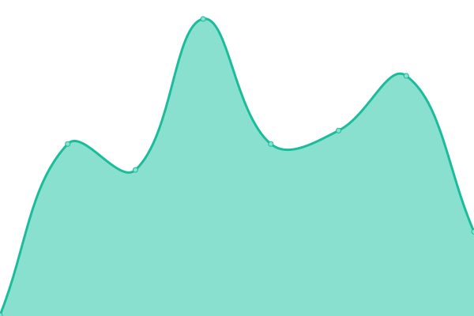
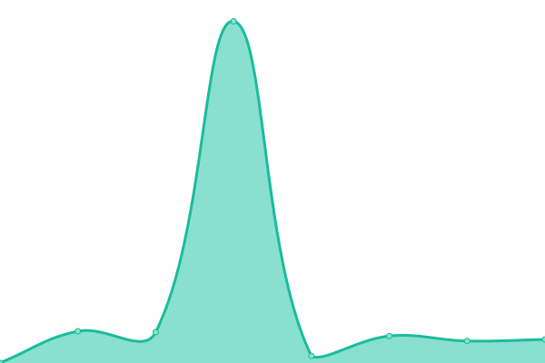

# [📈 Live Status](https://https://www.furniturebox.co.uk): <!--live status--> **🟧 Partial outage**

This repository contains the open-source uptime monitor and status page for [davidvaszily](https://https://www.furniturebox.co.uk), powered by [Upptime](https://github.com/upptime/upptime).

With [Upptime](https://upptime.js.org), you can get your own unlimited and free uptime monitor and status page, powered entirely by a GitHub repository. We use [Issues](https://github.com/davidvaszily/up/issues) as incident reports, [Actions](https://github.com/davidvaszily/up/actions) as uptime monitors, and [Pages](https://https://www.furniturebox.co.uk) for the status page.

<!--start: status pages-->
<!-- This summary is generated by Upptime (https://github.com/upptime/upptime) -->
<!-- Do not edit this manually, your changes will be overwritten -->
<!-- prettier-ignore -->
| URL | Status | History | Response Time | Uptime |
| --- | ------ | ------- | ------------- | ------ |
|  [Furniturebox](https://www.furniturebox.co.uk) | 🟩 Up | [furniturebox.yml](https://github.com/davidvaszily/up/commits/HEAD/history/furniturebox.yml) | 

 202ms
     
 | 

<a href="https://davidvaszily.github.io/up/history/furniturebox">100.00%</a>
    

|  [Amazon UK](https://www.amazon.co.uk) | 🟩 Up | [amazon-uk.yml](https://github.com/davidvaszily/up/commits/HEAD/history/amazon-uk.yml) | 

 751ms
     
 | 

<a href="https://davidvaszily.github.io/up/history/amazon-uk">100.00%</a>
    

|  [Amazon US](https://www.amazon.com) | 🟩 Up | [amazon-us.yml](https://github.com/davidvaszily/up/commits/HEAD/history/amazon-us.yml) | 

 155ms
     
 | 

<a href="https://davidvaszily.github.io/up/history/amazon-us">100.00%</a>
    

|  [B&Q](https://www.diy.com) | 🟥 Down | [b-and-q.yml](https://github.com/davidvaszily/up/commits/HEAD/history/b-and-q.yml) | 

 3970ms
     
 | 

<a href="https://davidvaszily.github.io/up/history/b-and-q">92.65%</a>
    

|  [Debenhams](https://www.debenhams.com) | 🟩 Up | [debenhams.yml](https://github.com/davidvaszily/up/commits/HEAD/history/debenhams.yml) | 

 675ms
     
 | 

<a href="https://davidvaszily.github.io/up/history/debenhams">100.00%</a>
    

|  [eBay UK](https://www.ebay.co.uk) | 🟩 Up | [e-bay-uk.yml](https://github.com/davidvaszily/up/commits/HEAD/history/e-bay-uk.yml) | 

 690ms
     
 | 

<a href="https://davidvaszily.github.io/up/history/e-bay-uk">100.00%</a>
    

|  [Facebook](https://www.facebook.com) | 🟩 Up | [facebook.yml](https://github.com/davidvaszily/up/commits/HEAD/history/facebook.yml) | 

 327ms
     
 | 

<a href="https://davidvaszily.github.io/up/history/facebook">100.00%</a>
    

|  [Google](https://www.google.com) | 🟩 Up | [google.yml](https://github.com/davidvaszily/up/commits/HEAD/history/google.yml) | 

 117ms
     
 | 

<a href="https://davidvaszily.github.io/up/history/google">100.00%</a>
    

|  [Instagram](https://www.instagram.com) | 🟩 Up | [instagram.yml](https://github.com/davidvaszily/up/commits/HEAD/history/instagram.yml) | 

 853ms
     
 | 

<a href="https://davidvaszily.github.io/up/history/instagram">99.28%</a>
    

|  [Pinterest UK](https://www.pinterest.co.uk) | 🟩 Up | [pinterest-uk.yml](https://github.com/davidvaszily/up/commits/HEAD/history/pinterest-uk.yml) | 

 438ms
     
 | 

<a href="https://davidvaszily.github.io/up/history/pinterest-uk">99.80%</a>
    

|  [Robert Dyas](https://www.robertdyas.co.uk) | 🟥 Down | [robert-dyas.yml](https://github.com/davidvaszily/up/commits/HEAD/history/robert-dyas.yml) | 

 150ms
     
 | 

<a href="https://davidvaszily.github.io/up/history/robert-dyas">0.00%</a>
    

|  [TikTok](https://www.tiktok.com) | 🟩 Up | [tik-tok.yml](https://github.com/davidvaszily/up/commits/HEAD/history/tik-tok.yml) | 

 685ms
     
 | 

<a href="https://davidvaszily.github.io/up/history/tik-tok">100.00%</a>
    

<!--end: status pages-->

[**Visit our status website →**](https://davidvaszily.github.io/up/)

## 📄 License

- Powered by: [Upptime](https://github.com/upptime/upptime)
- Code: [MIT](./LICENSE) © [Anand Chowdhary](https://anandchowdhary.com), supported by [Pabio](https://pabio.com)
- Data in the `./history` directory: [Open Database License](https://opendatacommons.org/licenses/odbl/1-0/)
